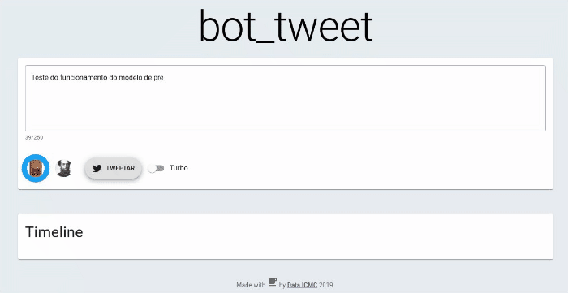

bot-tweet
==============================
 

This is a project displayed at Data Day (30/11/2019 - DD/MM/YYYY), a Data Science and Deep Learning event hosted by [Data](http://data.icmc.usp.br/),
an extension group located at University of São Paulo, São Carlos, Brazil.

The main idea is to mimetize the characteristics of famous writers by using Neural Networks and purpose the
interaction with the models to happen as if the user was in a Twitter interface, by using the skills of the desired writer to compose tweets. This repo is already loaded with two PT-BR models ("Bíblia" and "Brás Cubas"), but our architecture can be
used to any language with minor changes in our source code.

Project Organization
------------

    ├── LICENSE
    ├── Makefile           <- Makefile with commands like `make data` or `make train`
    ├── README.md          <- The top-level README for developers using this project.
    ├── data
    │   ├── external       <- Data from third party sources.
    │   ├── interim        <- Intermediate data that has been transformed.
    │   ├── processed      <- The final, canonical data sets for modeling.
    │   └── raw            <- The original, immutable data dump.
    │
    ├── demo               <- Used to host files used in README.md
    │
    ├── docs               <- A default Sphinx project; see sphinx-doc.org for details
    │
    ├── models             <- Trained and serialized models, model predictions, or model summaries
    │
    ├── notebooks          <- Jupyter notebooks. Naming convention is a number (for ordering),
    │                         the creator's initials, and a short `-` delimited description, e.g.
    │                         `1.0-jqp-initial-data-exploration`.
    │
    ├── poster             <- Our poster displayed at Data Day (30/11/2019 - DD/MM/YYYY)
    │
    │
    ├── references         <- Data dictionaries, manuals, and all other explanatory materials.
    │
    ├── reports            <- Generated analysis as HTML, PDF, LaTeX, etc.
    │   └── figures        <- Generated graphics and figures to be used in reporting
    │
    ├── requirements.txt   <- The requirements file for reproducing the analysis environment, e.g.
    │                         generated with `pip freeze > requirements.txt`
    │
    ├── setup.py           <- makes project pip installable (pip install -e .) so src can be imported
    ├── src                <- Source code for use in this project.
    │   ├── __init__.py    <- Makes src a Python module
    │   │
    │   ├── data           <- Scripts to download or generate data
    │   │   └── make_dataset.py
    │   │
    │   ├── features       <- Scripts to turn raw data into features for modeling
    │   │   └── build_features.py
    │   │
    │   ├── models         <- Scripts to train models and then use trained models to make
    │   │   │                 predictions
    │   │   ├── predict_model.py
    │   │   └── train_model.py
    │   │
    │   ├── web            <- React front-end and Python API 
    │   │   │                 
    │   │   ├── api.py     <- Python API
    │   │   └── ...        <- All other files are related to React front-end
    │   │
    │   └── visualization  <- Scripts to create exploratory and results oriented visualizations
    │       └── visualize.py
    │
    └── tox.ini            <- tox file with settings for running tox; see tox.testrun.org

--------

Setting-up the project
------------
- Run `make requirements`
- Run `make install`

Running the project
------------
- Open two terminals
- In the first one, run `make web`
- In the second one, run `make server`
- A web page will be opened and you can use the predictions after the server has loaded completely.

Software architecture
------------

The figure above ilustrates our software architecture. It consists of a web page built with React and a Python API that loads and hosts our Keras models.

This approach was used due to the lack of compatibility of Tensorflow.js with the Keras model we've built, so we decided to keep using our models in Python and create an API to make then modular to the front-end.

Keras model architecture
------------
The models are available in full detail in `/notebooks` folder. You're free to look them up!

Authors
------------
[Tobias Veiga](tobias.veiga@usp.br), [João Secundino](jp.secundino@usp.br), [João Pedro Mattos](joao_pedro_mattos@usp.br).

<small>Project based on the <a target="_blank" href="https://drivendata.github.io/cookiecutter-data-science/">cookiecutter data science project template</a>. #cookiecutterdatascience</small>

